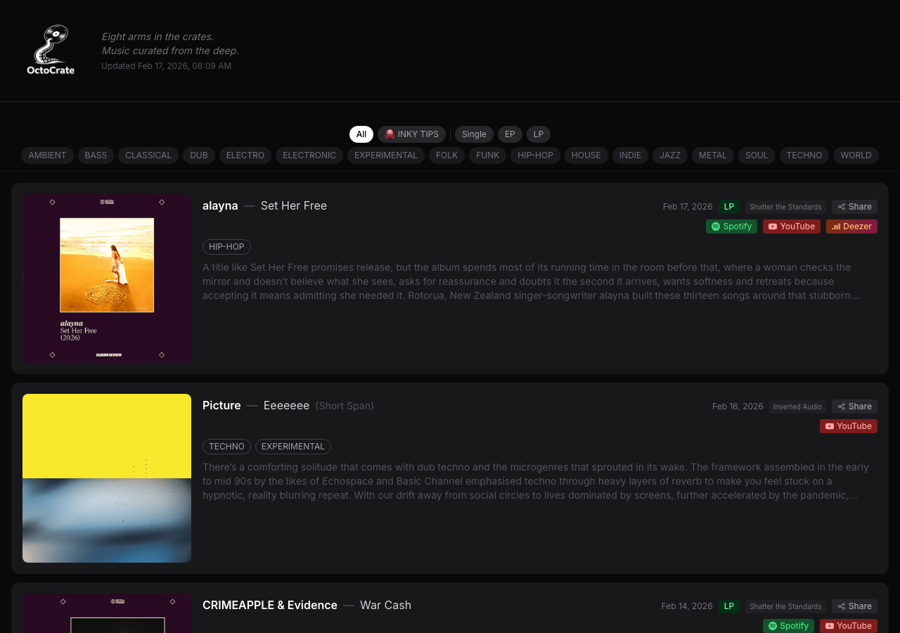

# OctoCrate

Eight arms in the crates. Music curated from the deep.

A music aggregator that pulls album reviews from 7 curated sources into a unified feed. Built for DJs and music lovers.



**Live:** [octocrate.vercel.app](https://octocrate.vercel.app)

## Tech Stack

Next.js 14 (App Router), TypeScript, Tailwind CSS, Turso (libSQL), Vercel

## Sources

- Nowa Muzyka
- Bandcamp Daily
- Resident Advisor
- Boomkat
- Inverted Audio
- Shatter the Standards
- DJ Mag

## Getting Started

```bash
npm install
npm run dev
```

See [CLAUDE.md](CLAUDE.md) for full documentation.
